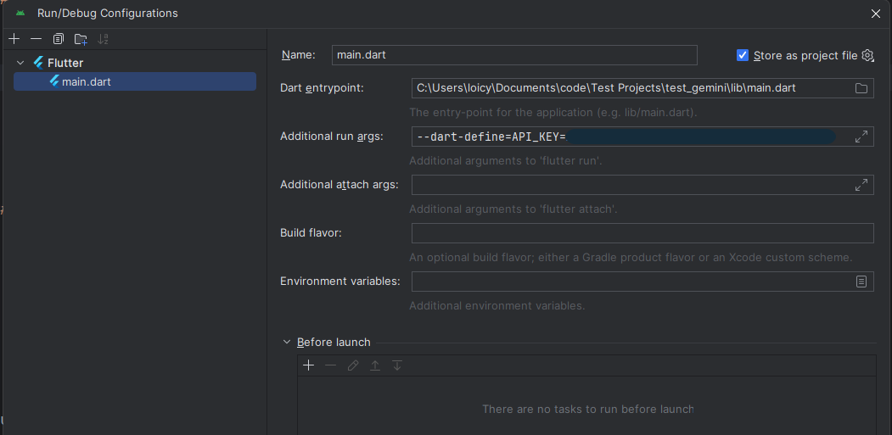
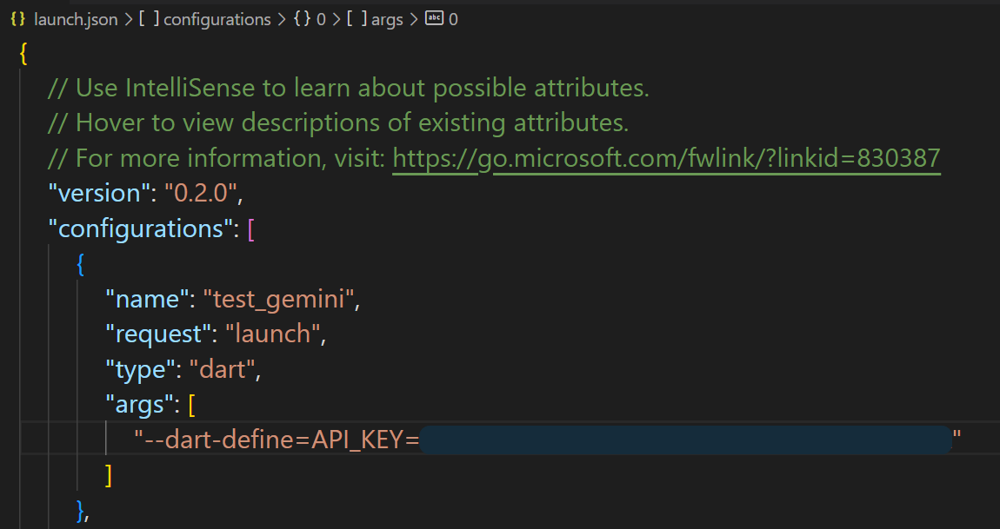
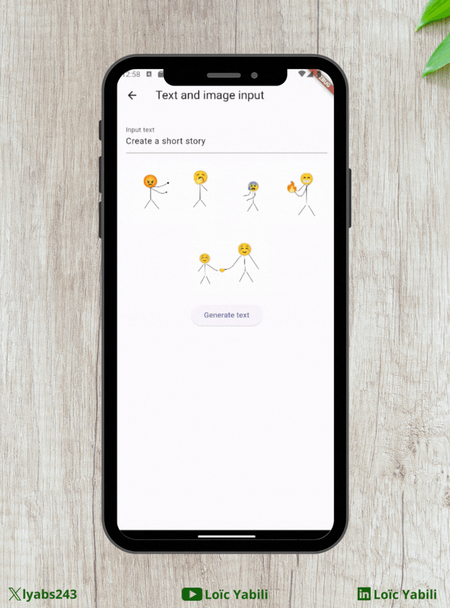
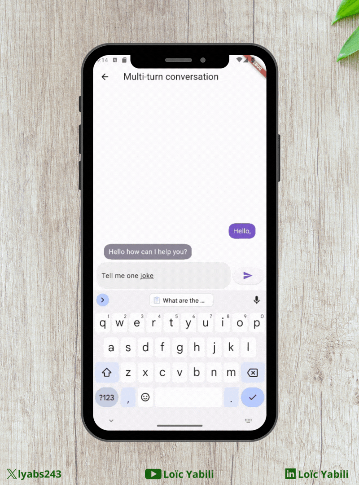
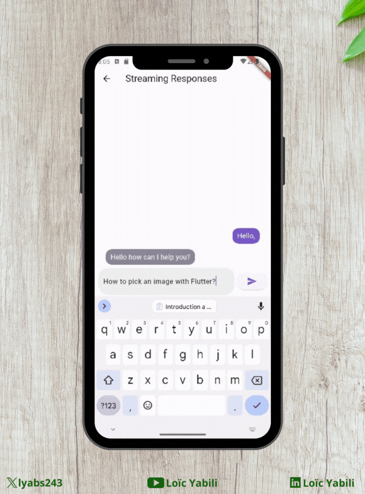

# Test Gemini

This is a test project using the Gemini AI with Flutter.

## Installation

To use this project, you need to have the Flutter SDK installed. You can find the [installation instructions](https://flutter.dev/docs/get-started/install).

To use the Gemini AI, you need to have an API key. [Get an API Key](https://makersuite.google.com/app/apikey).

To add your API key to the project, you have to add it to pass it to the flutter run command:

```bash
flutter run --dart-define=API_KEY=$YOUR_API_KEY
```
_Replace $YOUR_API_KEY with your API key._

You can set your IDE's run configuration to pass the API key.

### Android Studio

1. Open the project in Android Studio.
2. Click on the `main.dart` dropdown at the top of the window.
3. Click on `Edit Configurations...`.
4. In the `Additional run args` field, add `--dart-define=API_KEY
5. Click on `Apply` and `OK`.

Your configuration should look like this:



### VS Code

1. Open the project in VS Code.
2. Click on `Run and Debug` from the left sidebar.
3. Click on `create a launch.json file`.
4. Select `Dart & Flutter`.
5. Add `"args": ["--dart-define=API_KEY"] in the first configuration object.
6. Save the file.

Your file should look like this:



## Use cases

### Generate text from text-only input


### Generate text from text-and-image input (multimodal)



### Build multi-turn conversations (chat)



### Use streaming for faster interactions



## Tutorial

To learn more about this project with in-depth explanations, check out these links:

- [AI with Flutter and Dart: boost your applications with Gemini](https://lyabs.hashnode.dev/ai-with-flutter-and-dart-boost-your-applications-with-gemini)
- [IA avec Flutter et Dart: boostez vos applications avec Gemini](https://medium.com/@loicyabili/ia-avec-flutter-et-dart-boostez-vos-applications-avec-gemini-97e1d3ed5038)

## Complete demo

To see the complete demo, check out this video:

[Demo application using Gemini AI with Flutter and Dart](https://youtu.be/bZJnYAiGMFQ?si=lTiTcwXmC4tadym7)