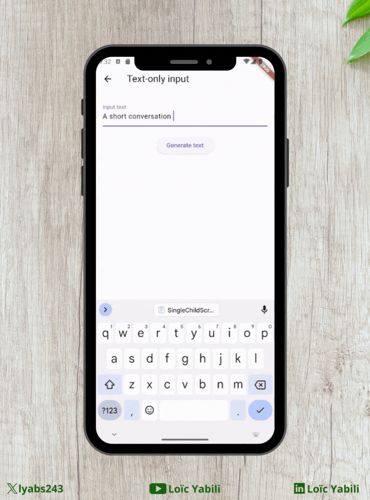

# Test Gemini

This is a test project using the Gemini AI with Flutter.

## Installation

To use this project, you need to have the Flutter SDK installed. You can find the [installation instructions](https://flutter.dev/docs/get-started/install).

To use the Gemini AI, you need to have an API key. [Get an API Key](https://makersuite.google.com/app/apikey).

To add your API key to the project, you have to add it to pass it to the flutter run command:

```bash
flutter run --dart-define=API_KEY=$YOUR_API_KEY
```
_Replace $YOUR_API_KEY with your API key._

You can set your IDE's run configuration to pass the API key.

### Android Studio

1. Open the project in Android Studio.
2. Click on the `main.dart` dropdown at the top of the window.
3. Click on `Edit Configurations...`.
4. In the `Additional run args` field, add `--dart-define=API_KEY
5. Click on `Apply` and `OK`.

Your configuration should look like this:


### VS Code

1. Open the project in VS Code.
2. Click on `Run and Debug` from the left sidebar.
3. Click on `create a launch.json file`.
4. Select `Dart & Flutter`.
5. Add `"args": ["--dart-define=API_KEY"] in the first configuration object.
6. Save the file.

Your file should look like this:


## Features

### [x] Generate text from text-only input



### [] Generate text from text-and-image input (multimodal)

In progress...

### [] Build multi-turn conversations (chat)

In progress...

### [] Use streaming for faster interactions

In progress...